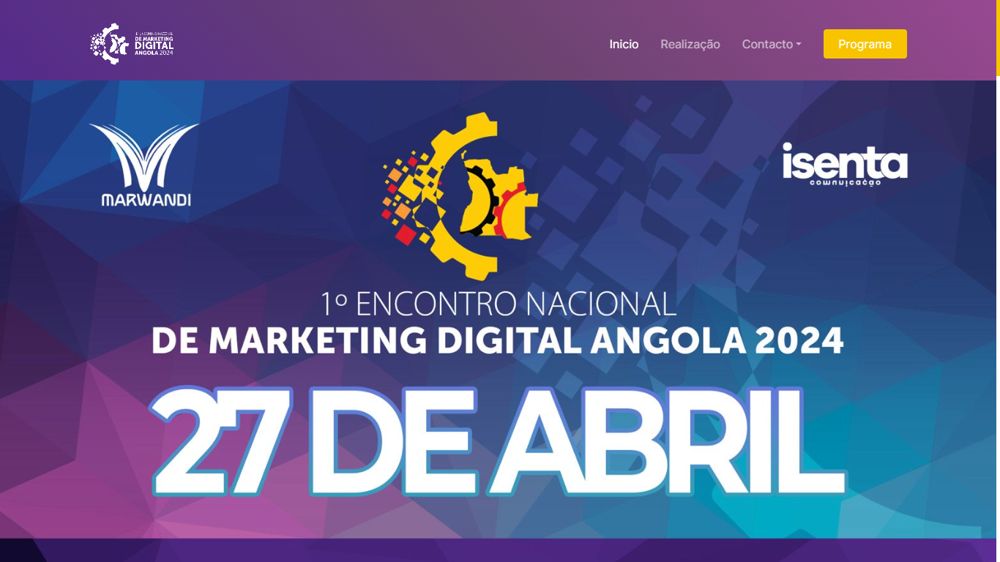

# Conferência Nacional de Marketing 2024 (Angola) - Website

## Visão Geral

Bem-vindo ao repositório do website oficial para a primeira Conferência Nacional de Marketing 2024 em Angola. Este site foi criado para fornecer todas as informações necessárias sobre o evento, incluindo palestrantes, agenda, local e muito mais.

## Tecnologias Utilizadas

Este site foi desenvolvido utilizando as seguintes tecnologias:

- **HTML5**: Para a estruturação do conteúdo.
- **CSS3**: Para o design e estilo visual.
- **JavaScript**: Para funcionalidades dinâmicas e interativas.
- **Bootstrap 5**: Para garantir um design responsivo e facilitar a criação de layouts modernos e atraentes.

## Funcionalidades

- **Totalmente Responsivo**: O site é totalmente responsivo e se adapta a diferentes tamanhos de tela, proporcionando uma experiência de usuário consistente em dispositivos desktop, tablets e smartphones.
- **Design Moderno**: Utiliza o Bootstrap 5 para uma aparência moderna e profissional.
- **Interatividade**: Elementos interativos desenvolvidos com JavaScript para melhorar a experiência do usuário.

## Screenshots

